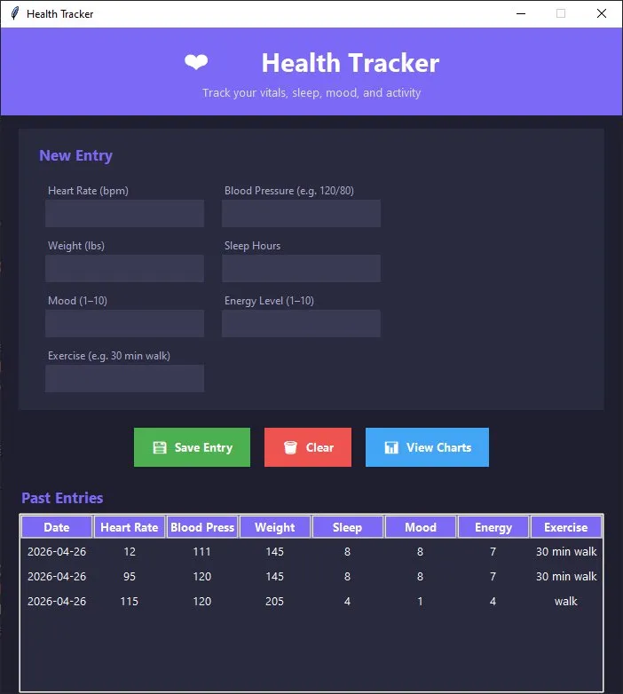

# ❤️ Health Tracker

A desktop application for tracking your daily health metrics, built with Python.



---

## Features

- **Vitals Logging** — Record heart rate, blood pressure, and weight
- **Wellness Tracking** — Log sleep hours, mood (1–10), and energy level (1–10)
- **Activity Logging** — Track daily exercise
- **Data Persistence** — All entries saved locally to a CSV file
- **Trend Charts** — Visualize your health trends over time with Matplotlib
- **Clean Dark UI** — Built with Tkinter and a modern dark theme

---

## Tech Stack

- **Python 3.10**
- **Tkinter** — GUI framework
- **Matplotlib** — Data visualization
- **CSV** — Local data storage

---

## Getting Started

### Prerequisites

- Python 3.10 or higher
- pip

### Installation

1. Clone the repository:
   ```bash
   git clone https://github.com/YOUR_USERNAME/health-tracker.git
   cd health-tracker
   ```

2. Install dependencies:
   ```bash
   pip install matplotlib
   ```

3. Run the app:
   ```bash
   python app.py
   ```

---

## Usage

1. Fill in your daily health metrics in the **New Entry** form
2. Click **Save Entry** to store the data
3. View your history in the **Past Entries** table
4. Click **View Charts** to see your trends over time

---

## Project Structure

```
health-tracker/
├── app.py            # Main application
├── health_data.csv   # Auto-generated data file
└── README.md
```

---

## Author

**Max** — Computer Engineering, B.S.  
[GitHub](https://github.com/YOUR_USERNAME)

---

## License

This project is open source and available under the [MIT License](LICENSE).
